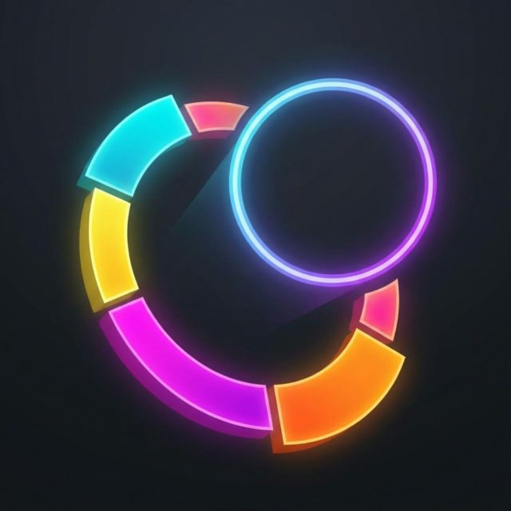

# Chromity

Chromity, Swift ve SpriteKit ile geliştirilmiş refleks odaklı bir iOS arcade oyunudur. Oyuncu, karakterin rengini engellerle eşleştirerek ilerler; görevleri ve bölümleri tamamlar, yıldız toplar ve farklı görünümlerin kilidini açar.

## Öne çıkan özellikler

- Renk eşleştirmeye dayalı sonsuz arcade oynanışı
- SpriteKit fizik sistemi ve durum makinesi tabanlı oyun akışı
- Günlük görevler, bölümler ve ilerleme sistemi
- Joker, kalkan ve yavaşlatma gibi güçlendirmeler
- Açılabilir karakter görünümleri ve arka planlar
- Özel fotoğrafı oyun arka planı olarak kullanabilme
- Game Center liderlik tablosu ve iCloud ilerleme eşitlemesi
- Türkçe ve İngilizce arayüz
- AdMob reklamları ve RevenueCat üzerinden reklamsız sürüm satın alımı

## Mimari

Oyun, UIKit içinde çalışan bir SpriteKit sahnesi üzerine kuruludur. Ana sahne; oynanış, engeller, arka planlar, görünümler ve katmanlar için uzantı dosyalarına ayrılmıştır. Oyun durumları GameplayKit durum makinesiyle yönetilir.

| Alan | Temel dosyalar |
| --- | --- |
| Uygulama yaşam döngüsü | `AppDelegate.swift` |
| SpriteKit sahnesi ve oyun akışı | `GameScene.swift` |
| Engeller ve fizik davranışları | `GameScene+Obstacles.swift` |
| Arka planlar ve görünümler | `GameScene+Backgrounds.swift`, `GameScene+Skins.swift` |
| Oyun durumları | `GameStateMachine.swift` |
| Görevler ve bölümler | `MissionManager.swift`, `ChallengeManager.swift` |
| Reklam ve satın alma | `AdManager.swift`, `StoreManager.swift` |
| Game Center ve iCloud | `GameCenterManager.swift`, `ICloudSyncManager.swift` |

## Kullanılan teknolojiler

- Swift 5
- UIKit, SpriteKit ve GameplayKit
- Game Center ve iCloud Key-Value Store
- Google Mobile Ads SDK 13.1.0
- Google User Messaging Platform 3.1.0
- RevenueCat 5.66.0
- En düşük iOS sürümü: iOS 18

## Çalıştırma

1. `Chromity.xcodeproj` dosyasını Xcode ile açın.
2. Swift Package Manager bağımlılıklarının yüklenmesini bekleyin.
3. `Chromity` şemasını seçerek iOS 18 veya daha yeni bir simülatörde ya da cihazda çalıştırın.

Geliştirme derlemelerinde Google'ın resmi test reklam birimleri, dağıtım derlemelerinde ise Chromity'nin gerçek reklam birimleri kullanılır.

## Gizlilik ve yapılandırma

Uygulama hesap oluşturmayı gerektirmez. Oyun ilerlemesi cihazda ve kullanıcının iCloud hesabında saklanır. Reklam izinleri Google User Messaging Platform üzerinden yönetilir; izleme izni yalnızca uygun durumda istenir.

Kaynak kodda bulunan AdMob kimlikleri ve RevenueCat `appl_` anahtarı, sunucu sırrı değil istemci SDK yapılandırma değerleridir. Özel imzalama anahtarları ve yerel yapılandırma dosyaları `.gitignore` ile depo dışında tutulur.

Gizlilik politikası: [emrealkan.com.tr/chromity](https://emrealkan.com.tr/chromity)

## Proje durumu

Chromity, App Store için geliştirilen ve güncellenmeye devam eden bir iOS oyunudur. Bu depo uygulamanın istemci kaynak kodunu içerir.

Telif hakkı © 2026 Emre Alkan. Tüm hakları saklıdır.
